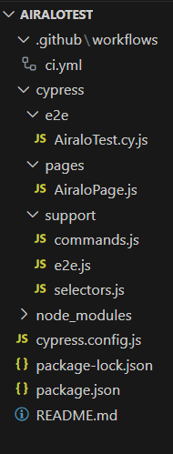

[](https://www.cypress.io/)

# Cypress Project for Airalo
This repository contains end-to-end tests for the Airalo eSIM purchase flow using Cypress.<br>
Site: https://www.airalo.com/

## Getting Started
These instructions will get you a copy of the project up and running on your local machine for testing purposes.

### Prerequisites
Before running the tests, ensure you have the following software installed on your local machine:

- [Node.js](https://nodejs.org/) (which includes npm)<br>
- Node.js® is a free, open-source, cross-platform JavaScript runtime environment that lets developers create servers, web apps, command line tools and scripts.
  Check if your current version is the same or if you have a more updated version.<br> 
__The version of this project is:__<br>
- Node Version: 21.2.0
- NPM version: 10.2.3

## Tools:
### Suggested IDEs by [Cypress documentation](https://docs.cypress.io/guides/tooling/IDE-integration.html#Extensions-amp-Plugins):

- [Visual Studio Code](https://code.visualstudio.com/) (Best option to work with Cypress and it's free). 
- [Intellij](https://www.jetbrains.com/idea/?var=1) (Alternative solution, also free)

### Installing
1. Clone the repository to your local machine:

> ```bash
>   git clone git@github.com:rcardosopereira/AiraloTest.git
> ```

2. Navigate to the project directory:

> ```bash
>   cd cypress-project
> ```

## Dependencies
### Official cypress framework:
- Cypress is a real game changer in e2e testing. It runs inside 2 containers on our stack. The setup was almost easy and its adoption by the team was immediate. *__Make sure you have Node.js installed and that you have already run "npm init" or have a "node_modules" folder or "package.json" file in the root of your project__* to ensure cypress is installed in the correct directory.
- [Cypress website](https://www.cypress.io/).
- The API documentation is available [here](https://docs.cypress.io/api/api/table-of-contents.html).

1. Install the dependencies:

> ```bash
>   npm install
> ```
or
> ```bash
>  npm install cypress --save-dev
> ```

### Running the tests
### Cypress run
Cypress give us the ability to run all tests without a test runner interface. Note that after executing the command, it will show a report on the screen with the tests that are passing and the tests that failed, if any. Furthermore, a new 'videos' folder will be created with their recordings.<br> 
To look, just go to the videos folder and access the files. (cypress/videos)<br>
To do this, just run the following command:<br>
1. To run the Cypress tests, use the following command:

> ```bash
> npm run test
> ```
or
> ```bash
> npm test
> ```
or
> ```bash
> yarn test
> ```

This will launch the Cypress Test Runner and execute the tests in the 'e2e' directory.

### Cypress test runner interface:
To open the Cypress and run the tests separately, run:
> ```bash
> npm run cy:open 
> ```
or
> ```bash
> npx cypress open
> ```

<br>
This will start the Cypress Test Runner with its interactive GUI where you can select which spec click on E2E Testing.

If you want to run the tests in another one, just add browser and the name of the browser in the command. More info in [here](https://docs.cypress.io/guides/guides/launching-browsers#Browsers).

### Test Structure
- .github/workflows/ci.yml: Contains the continuos integrations file to run in a github workflows.
- e2e/AiraloTest.cy.js: Contains end-to-end tests for the Airalo eSIM purchase flow.
- pages/AiraloPage.js: Page object representing the Airalo page and its actions.
- support/commands.js: Custom Cypress commands.
- support/selectors.js: Selector constants for DOM elements.


Below is a model image of how the report will be generated.<br>


### Contributing
If you'd like to contribute to this project, please follow these guidelines:

- Fork the repository
- Create your feature branch (git checkout -b feature/new-feature)
- Commit your changes (git commit -am 'Add some feature')
- Push to the branch (git push origin feature/new-feature)
- Create a new Pull Reques


####################################################################################
### Support🚀
Please, if you have some questions, feel free to contact me. My e-mail is rcardosopereira@gmail.com 
I am available to help you.
Thank you very much ;-)
####################################################################################
